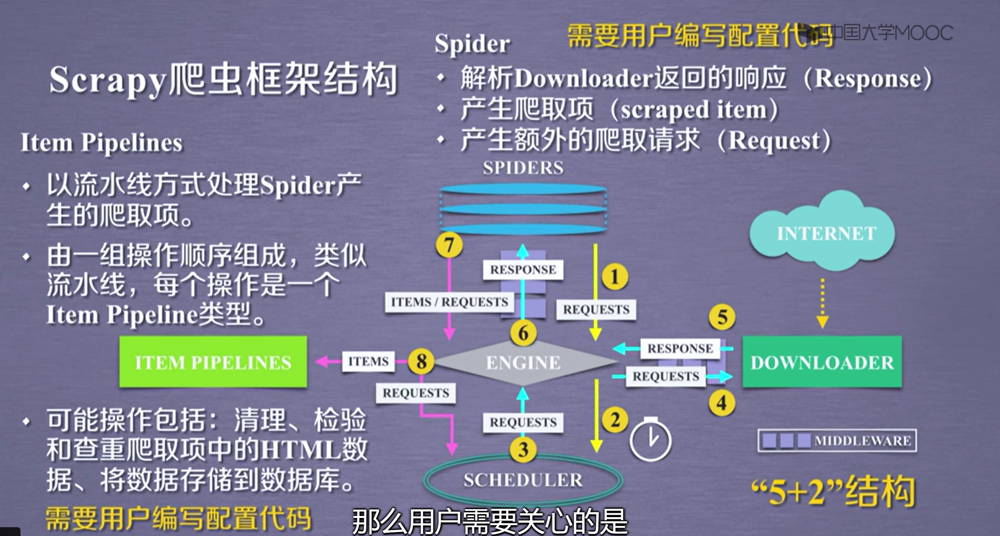
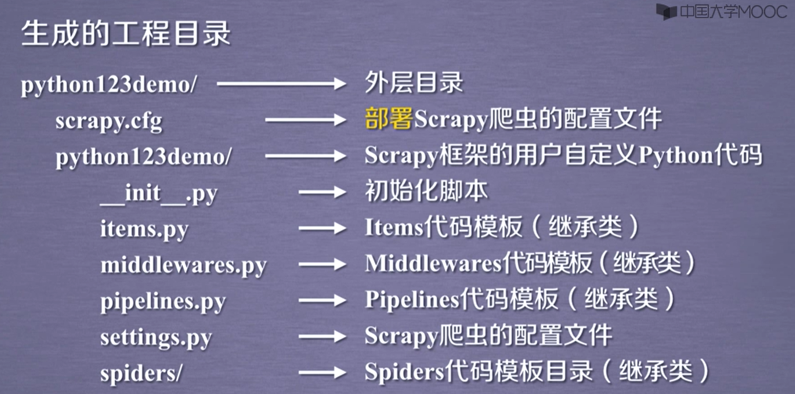
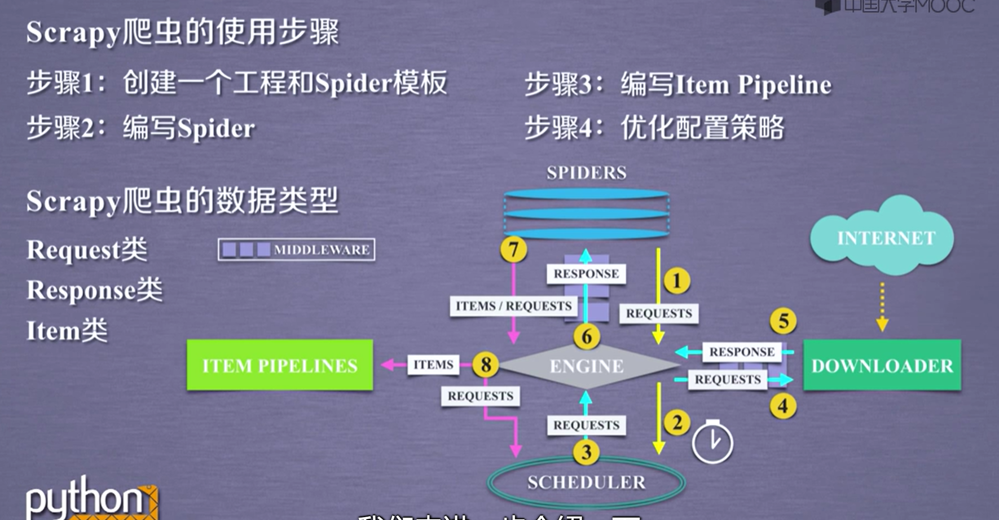

# 爬虫

[toc]

## Request库
```python
import requests
r = requests.get("url")
```

### Response对象的属性

|属性|说明|
|---|------|
|r.status_code|http请求的返回状态，200表示连接成功，404表示失败|
|r.text|http响应内容的字符串形式。即url对应的页面内容|
|r.encoding|从http header中猜测的响应内容编码方式|
|r.apparent_encoding|从内容中分析出的响应内容编码方式|
|r.content|http响应内容的二进制形式|


### Requests库异常
|类型|说明|
|---|------|
|requests.ConnectionError|网络连接错误异常，如DNS查询失败、拒绝连接等|
|requests.HTTPError|HTTP错误异常|
|requests.URLRequired|URL缺失异常|
|requests.TooManyRedirects|超过最大重定向次数，产生重定向异常|
|requests.ConnectTimeout|连接远程服务器超时异常|
|requests.Timeout|请求URL超时，产生超时异常|

```python
r.raise_for_status() #如果不是200，产生异常HTTPError
```

### 搜索引擎关键词提交
<!-- 以百度搜素为例 -->
<!-- https://www.baidu.com/s?wd= -->
```python
kv = {'wd': keyword}
r = requests.get(url,params=kv)
```

## Robots协议

作用：网站告知网络爬虫哪些页面可以爬取，哪些不行

形式： 在网站根目录下的robots.txt

```python
#当拒绝爬虫时可修改HTTP头部
kv = {'user-agent':'Mozilla/5.0'}
r = requests.get(url,headers = kv)
```

## Beautiful Soup库

```python
from bs4 import BeautifulSoup
soup = BeautifulSoup(demo,'html.parser')
```

### 基本元素

|基本元素|说明|
|---|------|
|Tag|标签，最基本的信息组织单元，分别用<>和</>标明开头和结尾|
|Name|标签的名字，\<p>...\</p>的名字是'p',格式：\<tag>.name|
|Attributes|标签的属性，字典形式组织，格式：\<tag>.attrs|
|NavigableString|标签内非属性字符串，<>...</>中的字符串，格式：\<tag>.string|
|Comment|标签内字符串的注释部分，一种特殊的Comment类型|

### 内容遍历方法

1. 标签树的下行遍历

|属性|说明|
|---|---|
|.contents|子节点的列表，将\<tag>所有儿子节点存入列表|
|.children|子节点的迭代类型，与.contents类似，用于循环遍历儿子节点|
|.descendants|子孙节点的迭代类型，包含所有子孙节点，用于循环遍历|

```python
for child in soup.body.children/descendants:
    print(child)
```

2. 标签树的上行遍历

|属性|说明|
|---|---|
|.parent|节点的父亲标签|
|.parents|节点先辈标签的迭代类型，用于循环遍历先辈节点|

3. 标签树的平行遍历

|属性|说明|
|---|---|
|.next_sibling|返回按照HTML文本顺序的下一个平行节点标签|
|.previous_sibling|返回按照HTML文本顺序的上一个平行节点标签|
|.next_siblings|迭代类型，返回按照HTML文本顺序的后续所有平行节点标签|
|.previous_siblings|迭代类型，返回按照HTML文本顺序的前序所有平行节点标签|

```python
for sibling in soup.a.next_siblings/.previous_siblings:
    print(sibling)
```

### bs4库的prettify()方法

```python
print(soup.prettify())
```

 ### 内容查找

```python
 soup.find_all(name,attrs,recursive,strinng,**kwargs)
 #返回一个列表类型，存储查找的内容
```
|属性|说明|
|---|---|
|name|对标签内容的检索字符串|
|attrs|对标签属性值的检索字符串，可标注属性检索|
|recursive|是否对子孙全部检索，默认为True|
|string|<>...</>中字符串区域的检索字符串|

```python
soup.find_all(string = re.compile("link"))#将标签中出现link的字符串域全部检索出来
```

```python
soup() 等价于 soup.find_all()
```
**扩展方法**
|方法|说明|
|---|---|
|<>.find()|搜索且只返回一个结果，字符串类型，同.find_all()参数|
|<>.find_parents()|在先辈节点中搜索，返回列表类型，同.find_all()参数|
|<>.find_parent|在先辈节点中返回一个结果，字符串类型，同.find_all()参数|
|<>.find_next_siblings()|在后续平行节点中搜索，返回列表类型，同.find_all()参数|
|<>.find_next_sibling()|在后续平行节点中返回一个结果，字符串类型，同.find_all()参数|
|<>.find_previous()_silbings()|在前序平行节点中搜索，返回列表类型，同.find_all()参数|
|<>.find_previous_silbing()|在前序平行节点中返回一个结果，字符串类型，同.find_all()参数|

## Re正则表达式库

正则表达式是用来简洁表达一组字符串的表达式
```import re```

### 正则表达式的常用操作符

|操作符|说明|实例|
|---|---|---|
|.|表示任何单个字符||
|[]|字符集，对单个字符给出取值范围|[abc]表示a、b、c，[a-z]表示a到z单个字符|
|[^]|非字符集，对单个字符给出排除范围|[^abc]表示非a或非b或c的单个字符|
|*|前一个字符0次或无限次扩展|abc*表示ab、abc、abcc、abccc等|
|+|前一个字符1次或无限次扩展|abc+表示abc、abcc等|
|?|前一个字符0或1次扩展|abc?表示ab、abc|
|\||左右表达式任意一个|abc\|def表示abc、def|
|{m}|扩展前一个字符m次|ab{2}c表示abbc|
|{m,n}|扩展前一个字符m至n次(含n)|ab{1,2}c表示abc、abbc|
|^|匹配字符串开头|^abc表示abc且在一个字符串的开头|
|$|匹配字符串结尾|abc$表示abc且在一个字符串的结尾|
|()|分组标记，内部只能使用\|操作符|(abc)表示，(abc|def)表示abc、def|
|\d|数字，等价于[0-9]||
|\w|单词字符，等价于[A-Za-z0-9]||

**经典正则表达式实例**

```^[A-Za-z]+$``` 由26个字母组成的字符串
```^[A-Za-z0-9]+$``` 由26个字母和数字组成的字符串
```^-?\d+$``` 整数形式的字符串
```^[0-9]*[1-9][0-9]*$``` 正整数形式的字符串
```[1-9]\d{5}``` 中国境内邮政编码，6位
```[\u4e00-\u9fa5]``` 匹配中文字符
```\d{3}-\d{8}|\d{4}-\d{7}```国内电话号码，010-68913536
```(([1-9]?\d|1\d{2}|2[0-4]\d|25[0-5]).){3}([1-9]?\d|1\d{2}|2[0-4]\d|25[0-5])``` ip地址

### Re库的基本使用

1. 正则表达式的表示类型

raw string类型(原生字符串类型，不包括转义符) ，表示为：r"text"
例如：r"[1-9]\d{5}"

string类型(包括转义符)，更繁琐

2. Re库的主要功能函数

|函数|说明|
|---|---|
|re.search(pattern,string,flags=0)|在一个字符串中匹配正则表达式的第一个位置，返回match对象。```pattern:正则表达式的字符串或原生字符串表示``` ```string:待匹配字符串``` ```flags:正则表达式使用时的控制标记```|
|re.match(pattern,string,flags=0)|从一个字符串的开始位置起匹配正则表达式，返回match对象。```pattern:正则表达式的字符串或原生字符串表示``` ```string:待匹配字符串``` ```flags:正则表达式使用时的控制标记```|
|re.findall(pattern,string,flags=0)|搜索字符串，以列表形式返回全部能匹配的子串。```pattern:正则表达式的字符串或原生字符串表示``` ```string:待匹配字符串``` ```flags:正则表达式使用时的控制标记```|
|re.split(pattern,string,maxsplit=0,flags=0)|将一个字符串按照正则表达式匹配结果进行分割，返回列表类型。```pattern:正则表达式的字符串或原生字符串表示``` ```string:待匹配字符串``` ```maxsplit:最大分割数，剩余部分作为最后一个元素输出``` ```flags:正则表达式使用时的控制标记```|
|re.finditer(pattern,string,flags=0)|搜索字符串，返回一个匹配结果的迭代类型，每个迭代元素是match对象。```pattern:正则表达式的字符串或原生字符串表示``` ```string:待匹配字符串``` ```flags:正则表达式使用时的控制标记```|
|re.sub(pattern,repl,string,count=0,flags=0)|在一个字符串中替换所有匹配正则表达式的字串，返回替换后的字符串。```pattern:正则表达式的字符串或原生字符串表示``` ```repl:替换匹配字符串的字符串``` ```string:待匹配字符串``` ```count:匹配的最大替换次数``` ```flags:正则表达式使用时的控制标记```|

3. flags:正则表达式使用时的控制标记

|常用标记|说明|
|---|---|
|re.I re.IGNORECASE|忽略正则表达式的大小写，[A-Z]能够匹配小写内容|
|re.M re.MULTILINE|正则表达式中的^操作符能够将给定字符串的每行当作匹配开始|
|re.S re.DOTALL|正则表达式中的.操作符能够匹配所有字符，默认匹配除换行外的所有字符|

4. Re库的另一种等价用法：
>rst = re.search(pattern,string) 函数式用法：一次性操作

>pat = re.compile(pattern) 面向对象用法，编译后的多次操作
rst = pat.search(string)

**compile函数**

```python
regex = re.compile(pattern,flags=0)
```

经过封装的==regex==为真正的正则表达式，可使用regex.search()等6种方法

### match对象

1. match对象的属性

|属性|说明|
|---|---|
|.string|待匹配文本|
|.re|匹配时使用的pattern对象(正则表达式)|
|.pos|正则表达式搜索文本的开始位置|
|.endpos|正则表达式搜索文本的结束位置|

2. match对象的方法

|方法|说明|
|---|---|
|.group(0)|获得匹配后的字符串|
|.start()|匹配字符串在原始字符串的开始位置|
|.end()|匹配字符串在原始字符串的结束位置|
|.span()|返回(.start(),.end())|

### 贪婪匹配和最小匹配

> 贪婪匹配：Re库默认采用贪婪匹配，即输出匹配最长的字串

**最小匹配操作符**

|操作符|说明|
|---|---|
|*?|前一个字符0次或无数次扩展，最小匹配|
|+?|前一次字符1次或无限次扩展，最小匹配|
|??|前一个字符0次或一次扩展，最小匹配|
|{m,n}?|扩展前一个字符m至n次，最小匹配|

## Scrapy爬虫框架

> 爬虫框架：是实现爬虫功能的一个软件结构和功能组件集合




==scrapy==命令在==cmd==命令行中实现

```cmd
scrapy -h
```

> scrapy \<command> [options] [args]

### scrapy常用命令

|命令|说明|格式|
|---|---|---|
|startproject|创建一个工程|scrapy startproject \<name> [dir]|
|genspider|创建一个爬虫|scrapy genspider [options] \<name> \<domain>|
|settings|获得爬虫配置信息|scrapy settings [options]|
|crawl|运行一个爬虫|scrapy crawl \<spider>|
|list|列出工程中所有爬虫|scrapy list|
|shell|启动URL调试命令行|scrapy shell [url]|

### 爬虫实例

```cmd
scrapy startproject python123demo
```



### yield关键字  

yield 等价于 生成器

> 生成器是一个不断产生值的函数

> 包含yield语句的函数是一个生成器

> 生成器每次产生一个值(yield语句)，函数被冻结，被唤醒后再产生一个值

### scrapy爬虫基本使用



1. Request类

|属性或方法|说明|
|---|---|
|.url|Request对应的请求URL地址|
|.method|对应的请求方法,'GET''POST'等|
|.headers|字典类型风格的请求头|
|.body|请求内容主体，字符串类型|
|.meta|用户添加的扩展信息，在Scrapy内部模板间传递信息使用|
|.copy()|复制该请求|

2. Response类型

|属性或方法|说明|
|---|---|
|.url|Response对应的请求URL地址|
|.status|HTTP状态码，默认是200|
|.headers|Response对应的头部信息|
|.body|Response对应的内容信息，字符串类型|
|.flags|一组标记|
|.request|产生Response类型对应的Request对象|
|.copy()|复制该响应|

3. Item类

### CSS Selector的基本使用

```
<HTML>.css('a::attr(href)').extract()
```

### 配置并发连接选项

|选项|说明|
|---|---|
|CONCURRENT_REQUESTS|Downloader最大并发请求下载数量，默认32|
|CONCURRENT_ITEMS|Item Pipeline最大并发ITEM处理数量，默认100|
|CONCURRENT_REQUESTS_PER_DOMAIN|每个目标域名最大的并发请求数量，默认8|
|CONCURRENT_REQUESTS_PER_IP|每个目标IP最大的并发请求数量，默认0，非0有效|
